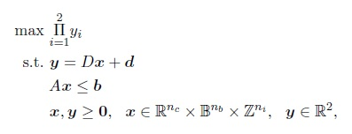
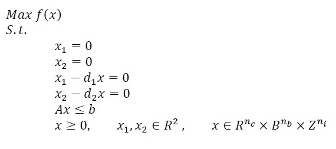
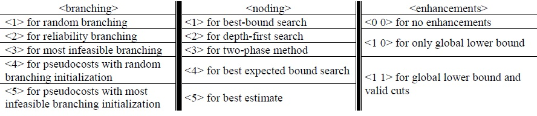

# BOMILP-MMP-algorithm
A Branch-and-Bound Algorithm for a  Bi-objective Mixed Integer Linear Maximum Multiplicative Programs

This is an algorithm to solve a class of bi-objective Mixed Integer Linear Maximum Multiplicative Programs of format:

where nc, nb, and ni represent the number of continuous, binary, and integer decision variables, respectively. Also, D is a 2 * n matrix where n:= nc+ nb + ni, d is a 2-vector, A is an m * n matrix, and b is an m-vector.

This project is a Netbeans IDE 8.2 C++ project which was written in Linux (Ubuntu).

To compile the code, CPLEX (default version 12.7) must be installed on your computer. The default directory for CPLEX used is /opt/CPLEX/12.7/. Changing the directory of CPLEX to your preferred directory can be done either in the Makefile or through Netbeans. If you would like to do it in the Makefile you should go to nbproject/Makefile-Debug.mk and nbproject/Makefile-Release.mk and change all instances of /opt/CPLEX/12.7/ to your preferred directory. If you would like to do it through Netbeans, you can open the project in Netbeans and right click on the name of the project and choose Properties. You can then change the directory in the Include Directories box which is located in the C++ Compiler sub-menu. Moreover, you should also change the directory in the Libraries box which is located in the Linker sub-menu.

# Branch-and-Bound

In our algorithm, we have implemented different branching and node selecting strategies. The branching strategies and their indicating number are as follows,
Random branching <1>, Reliability branching <2>, Most infeasible branching <3>, Pseudocosts with random branching initialization <4>, and Pseudocosts with most infeasible branching initialization <5>.

The node selecting strategies and their indicating number are as follows,
Best-bound search <1>, Depth-first search <2>, Two-phase method <3>, Best expected bound <4>, and Best estimate <5>.

It should be noted that, since best expected bound and best estimate need estimated costs of each node for node selection, only reliability branching and Pseudocosts branchings can be implemented with them.

# Enhancements
As enhancement, our algorithm is able to do some preprocessing before solving the problem. If preprocessing is selected, its time limit is 10% of the number of variables. For enhancements, if one doesnot want to have the preprocessing phase, the code <0 0> should be used. If one wants to have the preprocessing phase to provide a primary global lower bound for the algorithm, the code <1 0> should be used. And, if one wants to have the primary global lower bound and the valid cuts added to the algorithm, the input <1 1> should be used.

It should be noted that based on our experiments <1 1> works the best for the time that the instance has no integer variables, and <0 0> works the best when the instance has no binary variables.

# Data Files
The instances used in the computational experiments of this algorithm are available in https://goo.gl/bgHciY.

For further instances, each data file should be written as a CPLEX LP file as follows,

where f(x) can be any arbitrary function which the algorihm will remove, x1 and x2 are the objective functions respresenting the y1 and y2 of the problem, and the rest of x are the decision variables.

In order to make our algorithm faster, it needs two input files; one is the instance file, and the other is the relaxed format of the instance, that is, the binary and integer constraints should be eliminated in the second file. Binary constraints appear as "Binaries" and integer constraints appear as "Generals" at the end of the .lp file.

# Compiling and Running

Compiling the project can be done using the Terminal by going to the directory in which the project is saved and typing ”make clean” followed by ”make” (you can also compile through Netbeans).

An instance can be solved by typing 

./BOMILP-MMP <*address*>/<instance*> <*address*>/<relaxed instance**> <*branching*> <*noding*> <*enhancements*>

where instance* is the original .lp file of the instance, instance** is the relaxed .lp file of the instance, and

For better understanging, we have provided a folder named instance in the algorithm folder. In instance folder, 1.lp is the problems original file, and 2.lp is the relaxed form of the problem. In order to solve this instance using most infeasible branching, best-bound search, and no enhancements, one can use the code

make clean
make
./BOMILP-MMP instance/1.lp instance/2.lp 3 1 0 0

# Supporting and Citing

The software in this ecosystem was developed as part of academic research. If you would like to help support it, please star the repository as such metrics may help us secure funding in the future. We would be grateful if you could cite:

[Ghasemi Saghand, P., Charkhgard, H., Kwon, C., A Branch-and-Bound Algorithm for a Class of Mixed Integer Linear Maximum Multiplicative Programs: A Bi-objective Optimization Approach, Computers & Operations Research, 2018, ISSN 0305-0548,](https://doi.org/10.1016/j.cor.2018.08.004)
